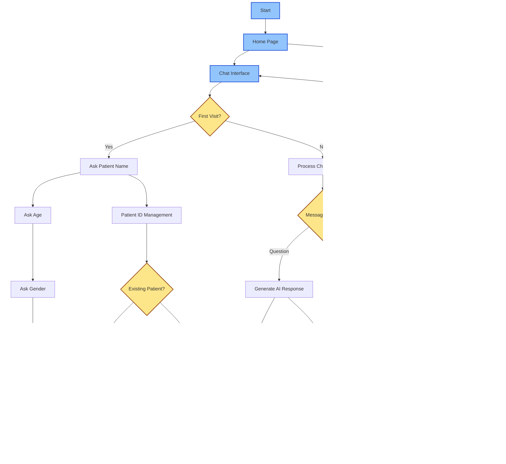

```mermaid
flowchart TD
    A[Start] --> B[Home Page]
    B --> C[Chat Interface]
    
    %% Patient Information Flow
    C --> D{First Visit?}
    D -->|Yes| E[Ask Patient Name]
    E --> F[Ask Age]
    F --> G[Ask Gender]
    G --> H[Ask Mobility Status]
    H --> I[Ask Medical History]
    I --> J[Ask Operation Type]
    J --> K[Ask Concerns]
    
    %% Chat Processing
    D -->|No| L[Process Chat Message]
    L --> M{Message Type?}
    M -->|Question| N[Generate AI Response]
    M -->|Summary Request| O[Generate Patient Summary]
    
    %% Database Operations
    N --> P[Save Chat History]
    O --> P
    P --> Q[Store in Cloud SQL]
    
    %% Admin Features
    B --> R[Admin Login]
    R --> S[Admin Dashboard]
    S --> T[View Patient Details]
    T --> U[Access Chat History]
    
    %% Patient Identification System
    E --> V[Patient ID Management]
    V --> W{Existing Patient?}
    W -->|Yes| X[Load Patient History]
    W -->|No| Y[Create New Patient]
    
    %% Error Handling
    N --> Z[Error Handling]
    Q --> Z
    Z -->|Success| C
    Z -->|Error| AA[Log Error with Stack Trace]
    
    %% Styling
    classDef primary fill:#93c5fd,stroke:#1d4ed8,stroke-width:2px
    classDef secondary fill:#fde68a,stroke:#92400e,stroke-width:2px
    classDef error fill:#fca5a5,stroke:#991b1b,stroke-width:2px
    
    class A,B,C primary
    class D,M,W secondary
    class Z,AA error
```
